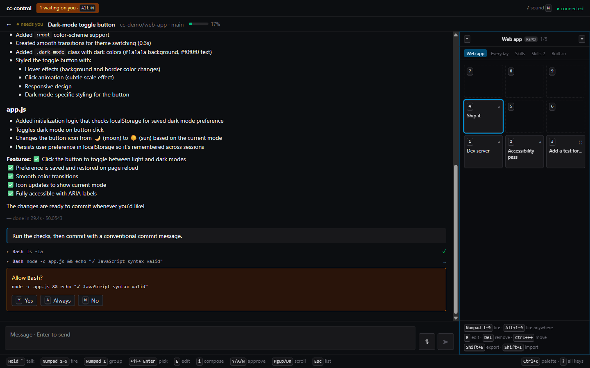
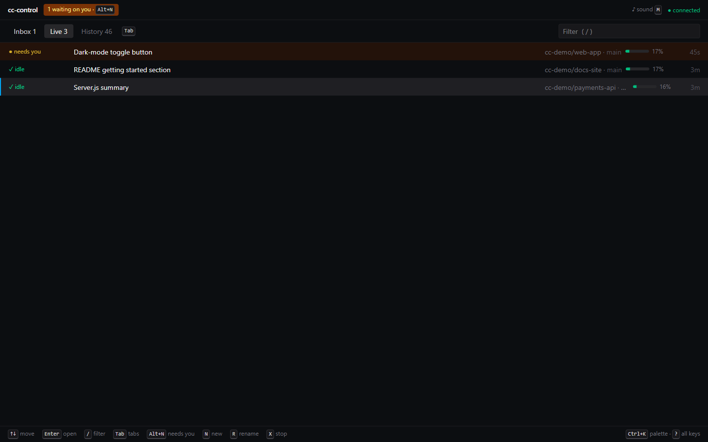
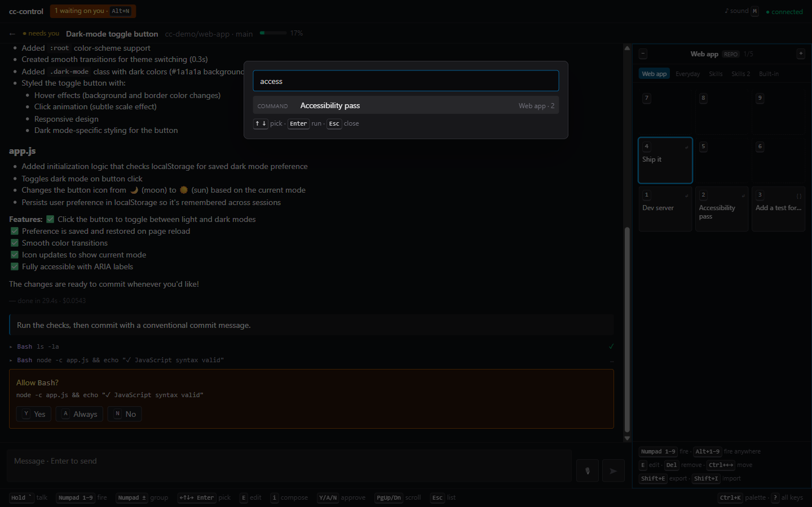

# cc-control

**A keyboard-first command center for Claude Code.** See every session on your machine in one list, jump straight to whichever one needs you, and drive it with the number pad or your voice.



## Why

Running several Claude Code sessions at once means a lot of terminal-tab hunting: which one finished, which one is waiting on a permission prompt, which one needs the same "run the tests and summarise failures" prompt you've typed ten times today. cc-control puts all of them on one screen, and makes the common moves single keystrokes.

- **Know who needs you.** Sessions waiting for an approval or that just finished land in an Inbox. `Alt+N` jumps to the next one from anywhere; `Y` / `A` / `N` answers. Clearing a blocked session takes two keys.
- **A hotbar for prompts.** Every session has a 3×3 command board laid out like a numpad. `Numpad 1–9` fires a command; tiles can send immediately, drop text into the composer, or ask for a blank first (`Explain {{what}}`).
- **Share workflows through git.** Commit `.cc-control/commands.json` to a repo and everyone who opens a session there gets the same commands. The session's own slash commands and skills appear automatically too.
- **See what it's doing.** A live line shows what each session is doing right now (thinking, running `npm test` for 12s, retrying the API), plus any subagents and background shells, each with a stop button. `Esc` stops Claude, just like in the terminal.
- **Talk to it.** Hold `` ` `` (or `Numpad .`), speak, release: it's sent. Say a command's name ("code review") to run it.
- **Everything discoverable.** `Ctrl+K` searches every action, command and session; `?` lists every key (and lets you rebind them); the bottom bar always shows the keys that work right now.

| Session list | Command palette | On a phone |
|---|---|---|
|  |  |  |

## Quick start

You need **Node 24+**, **pnpm**, and the **Claude Code CLI, logged in**. cc-control runs on your existing Claude login; no API key needed.

```sh
git clone https://github.com/ryan-stephens/claude-command-center.git
cd claude-command-center
pnpm install
pnpm start          # builds the app and serves http://localhost:7777
```

Open **http://localhost:7777** in Chrome or Edge. A short welcome card shows the five keys worth knowing.

## Keys you'll use

| Where | Key | Does |
|---|---|---|
| Anywhere | `Alt+N` | Jump to the next session that needs you |
| | `Ctrl+K` | Command palette |
| | `?` | Every key binding (`B` there to rebind) |
| | `Alt+↑` / `Alt+↓` | Previous / next session |
| Session list | `↑ ↓` `Enter` | Pick and open a session |
| | `N` | New session (pick a repo, optional first prompt) |
| | `Tab` | Inbox → Live → History |
| Session | `Numpad 1–9` / `Alt+1–9` | Fire a command |
| | `Numpad ±` | Switch command group |
| | `Y` / `A` / `N` | Approve once / always / deny |
| | Hold `` ` `` | Push-to-talk |
| | `Esc` (while working) | Stop Claude, like in Claude Code |
| | `Ctrl+B` | Send the running tool to the background |
| | `Esc` | Step out: composer → board → list |

## Sharing commands with your team

Put a pack at `.cc-control/commands.json` in any repo; cc-control picks it up for sessions started there:

```json
{
  "version": 1,
  "groups": [
    {
      "name": "Web app",
      "commands": [
        { "slot": 1, "label": "Dev server", "body": "Start the dev server and tell me the URL.", "mode": "send" },
        { "slot": 3, "label": "Add a test for…", "body": "Add a unit test covering {{behaviour}}.", "mode": "template" }
      ]
    }
  ]
}
```

Your personal commands live in a local SQLite file and can be exported or imported as the same JSON (`Shift+E` / `Shift+I` on the board). You can also create and edit tiles in the app: focus one and press `E`.

## How it works

```
Browser (React + Vite)  ⇄  WebSocket  ⇄  Node server on 127.0.0.1:7777
                                           ├─ one Claude Agent SDK session per live conversation
                                           ├─ approvals held until you answer Y / A / N
                                           ├─ history from ~/.claude/projects (resume or fork any session)
                                           └─ node:sqlite for your commands and settings
```

- Built on [`@anthropic-ai/claude-agent-sdk`](https://www.npmjs.com/package/@anthropic-ai/claude-agent-sdk). Sessions are real Claude Code sessions stored alongside your terminal ones: every terminal session is listed here and can be resumed, and anything started here can be continued in a terminal with `claude --resume <id>`.
- If a session looks open in a terminal, sending to it **forks** a copy instead of writing into the same transcript.
- Voice uses the browser's Web Speech API (Chrome and Edge send the audio to Google's speech service).

**Security:** the server only listens on `127.0.0.1` and only accepts pages it served itself (Host and Origin checks). It can run tools on your machine, so treat it like a terminal and don't expose it to a network.

## Development

```sh
pnpm dev        # server with --watch + Vite on http://localhost:5173
pnpm test       # unit tests (node:test)
pnpm typecheck
```

| Path | What |
|---|---|
| `server/` | Node server, run as TypeScript directly (Node 24 type stripping, no build step) |
| `web/` | React SPA; `web/keys.ts` is the single keyboard router |
| `shared/protocol.ts` | WebSocket message types shared by both |
| `docs/PLAN.md` | Design, decisions and per-phase notes |

<details>
<summary>Advanced: using it from your phone over Tailscale</summary>

Optional and off by default. With [Tailscale](https://tailscale.com) on this machine and your phone:

```sh
pnpm start -- --remote                  # also listens on this machine's Tailscale IP only
pnpm start -- --remote --rotate-token   # revoke the previous sign-in link
```

It prints a one-time sign-in link containing a secret token; open it on your phone and treat it like a password. See `docs/PLAN.md` §14 for the details.
</details>
