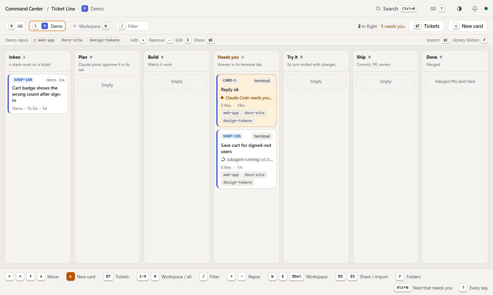
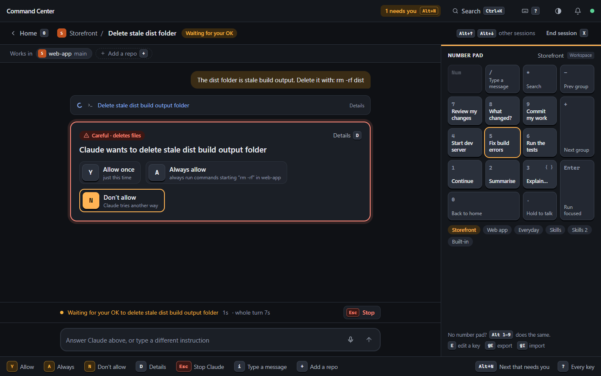
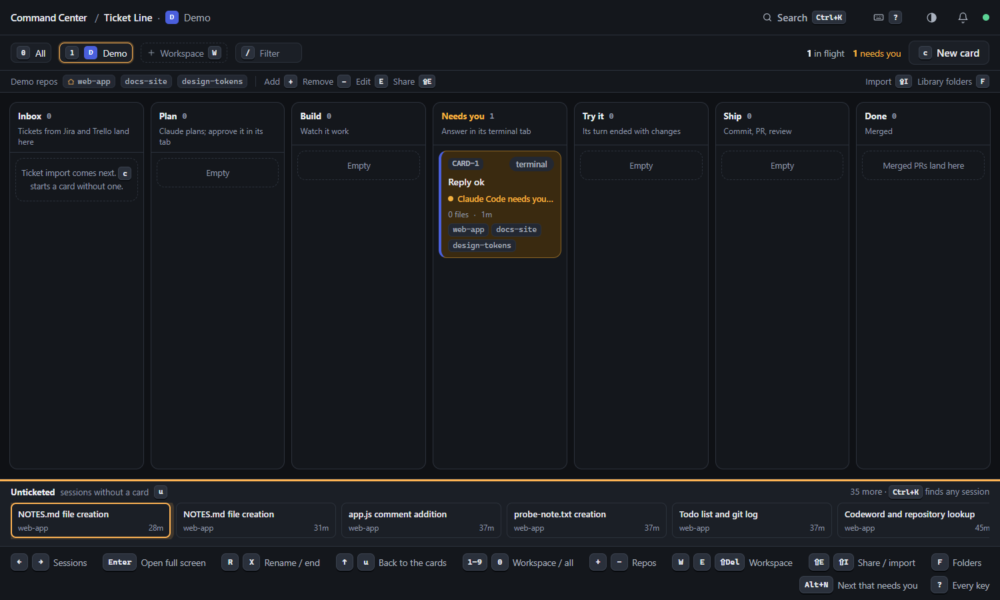
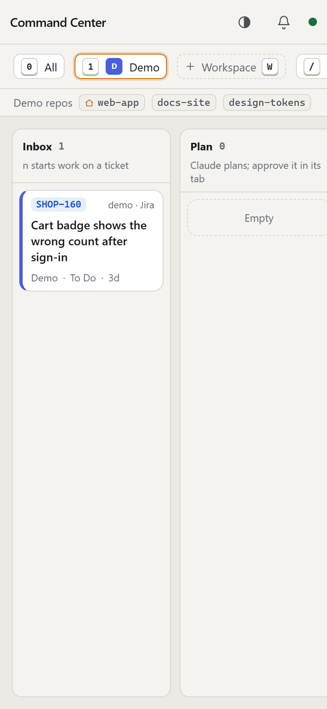

# Command Center for Claude Code

**A keyboard-driven cockpit for your Claude Code sessions.** Your work is a board of cards, the **Ticket Line**: each card gathers its context, starts a Claude Code session right in the card, and moves by itself from Plan to Build to Try it as the session works. Group your repos into workspaces, see at a glance what needs you, and drive every session with the arrow keys, the number pad or your voice. Everything also works with a mouse.



## Why

Running several Claude Code sessions across several repos means a lot of terminal-tab hunting: which one finished, which one is waiting on a permission prompt, which repo it was in, and typing the same "run the tests and summarise failures" prompt for the tenth time. Command Center puts all of it on one screen and makes the common moves single keystrokes.

- **Tickets in the Inbox.** Jira and Trello tickets (read-only; tokens stay on the server) land in the Inbox, each project mapped to a workspace. `n` on one opens the new-card screen with its description and acceptance criteria as the card's context, and the card is named after the ticket. Demo tickets let you try it before connecting a site.
- **The Ticket Line.** `c` makes a card: pick repos from your library, write a note, choose the model (`m`) and how it starts, and `p` previews exactly what Claude will be told. `Ctrl+Enter` makes the branch and starts Claude with that context, in the app: the card's chat is the session. From then on the card follows it: *Plan*, *Build*, amber in *Needs you* when it asks something, *Try it* when its turn ends with changes. `Ctrl+Enter` on a card opens its session full screen.
- **QA and code review, not only development.** `k` on the new-card screen makes a card *Develop*, *QA* or *Code review*. A QA card has Claude write a test plan from the ticket, set up the test data the way your workspace's testing notes say, walk you through each check and finish with a pass/fail report. A review card finds the ticket's pull request (GitHub or Azure DevOps, read-only), opens a copy of the repo on its branch, and reviews it against the ticket. Reports and findings stay on the card for you to copy (`s`); nothing is posted. `v` switches the Inbox to every ticket *Ready for QA* in your projects, and `/` on the new-card screen searches Jira for anyone's ticket.
- **Any folder as context.** Besides tickets and library repos, the new-card screen's *Folders* tab adds any folder on disk (specs, docs, a tool's install), given to Claude with `--add-dir`.
- **Talk to the session from here.** A card's session runs in the app (through Claude Code's SDK, with your own settings, skills and MCP servers), so the open card is the conversation: the reply streams in as Claude writes, `Enter` sends at once, `y` / `n` answer a tool prompt or a plan, Claude's question forms are answered on the card, and `Esc` stops a turn the way it does in Claude Code. A session that isn't running (the server restarted) is resumed by the next message. `g` hands it to a Windows Terminal tab (`claude --resume`) when you want the real TUI, and the card follows it there. (`CC_CONTROL_CARDS_IN_TERMINAL=1` starts cards in a tab the old way, for one release.)
- **Try it.** `t` on a card starts its app in the card's own folder, the way its repo says (`package.json`, `compose.yaml`) or the way you set up with `e`: what starts it, an install step first, where it serves, what runs on stop; the lines are written from those answers, and *Advanced* holds them for anything more. It shows each step, what the app prints and where it is; `o` opens it, `t` again stops it. The lines can say more: `@api okteto deploy --wait`, `@web API_URL=https://… npm run dev`, `! something to do by hand`, `stop: @api okteto destroy`. Steps can also run in PowerShell (`ps:`), answer the questions they ask (`answers:"y,n"`), and say when they're ready (`wait:"Now listening on"`, `wait:port:8080`, or `wait:http:8080/health`, which asks that address every second until it answers below 500 and fails the run after 10 minutes; use it when a forwarded port opens before the app behind it, as with `okteto up`).
- **A stack of APIs and the UI.** A lane of several repos has a stack: `e` opens it as a form (`t` on a lane with none yet opens the same form filled from what the repos say, with *Save and start*). Tick the APIs Try it can start, each with its name on the dev environment and its route in the proxy; pick the UI repo and its proxy file; answer once how an API starts there (the command that makes its deployment, what runs in the container, what to delete on stop), and every API starts that way. Ports, folders, health paths, the UI's start line, the proxy rule and the lines themselves sit behind *Advanced*. In the open card's Try it panel you tick which APIs this card runs; APIs changed on the card's branch are ticked for you. Each picked API and the UI get a local port of their own for that run (`{{port}}`, `{{uiPort}}`, from `CC_CONTROL_PORTS`, 18000–18999 by default), so two cards can run the same stack at the same time; an `okteto up` line runs with a copy of the API's okteto.yml forwarding that port (nothing to write; `forward:no` on the line keeps the manifest's own), and `{{deployment}}` is the deployment's name cut to 50 characters as the helper cuts it. The picked APIs start, then the UI, with a copy of its proxy file pointed at them; its URL is the served app's own port and baseHref from its project file (an nx workspace's `apps/<name>/project.json`) unless the stack says otherwise, and Try it names the app. The repo's file isn't touched. `t` again stops everything and runs the teardown steps. PLAN §42 and §54 have the format. A Develop card works in **worktrees of its own** by default: every repo in the card gets its own folder on the card's branch (`loans-api-card-4` next to `loans-api`), Claude works there, a repo you add later with `c` gets one too, and Try it runs every API and the UI from those folders, so it always runs that card's code whatever your usual folders are on, and several cards in the same repos never touch each other's files. A worktree of a repo with packages gets the main checkout's installed node_modules as a folder of hard links (the same files on disk under a second name: nothing downloaded, no extra space), in the background when it is made, and Try it puts them in any folder still without as its first step; when the branch's lockfile differs from the main checkout's the card says so. Removing the worktree in any way, `git worktree remove` by hand included, leaves the main checkout's install whole (PLAN §110, §111). What it costs: if you open the session in a terminal (`g`), Claude Code asks once there to trust each new folder (the *Keys and hints* dialog, `?` then `B`, has a setting that marks them trusted first; it says exactly what it writes). `Shift+X` on a card lists its worktrees with what each still holds and, once the card is Done, removes them with their branch; the clean ones on `Enter`, the rest on `f` after it has said what would be lost. Removing a card offers the same (`w`). *Current branch* and *New branch here* stay on the Branch row for a quick look or a repo you don't want copied (PLAN §53, §54).
- **Ship.** `s` commits the files the card's session wrote (you tick any others, by name), pushes, and opens a PR written from the ticket, with its acceptance criteria as a checklist. A card that changed several repos ships each from its worktree: the sheet shows one block per repo, one PR opens in each (they link each other), the card lists them, and `s` again squash-merges them all; the card is Done once every PR is merged. If a push or PR fails part-way, the repos before it are shipped and the card says which are left: `s` again ships only those, with the shipped repos shown as such.
- **Add context later.** `c` in a card's drawer adds a repo, a related ticket or a note to work already under way. Between turns it goes to Claude at once; while Claude works it waits and goes in with your next message. The card's Context panel shows what went in when. On a worktree card a repo gets a worktree on the card's branch; if its files say it is an API (or the UI) it joins the workspace's stack, so `t` can start it from that worktree; a note naming an API makes `t` suggest it.
- **Workspaces.** Group the repos you work on together ("Storefront", "Payments") and pick them with `1`–`9`. **Every card and session in a workspace can use all of its repos**, so Claude can change the API and the web app in one go. `+` adds a repo from your **repo library** (the git repos under folders you pick with `F`), `−` removes one.
- **Know who needs you.** Cards that need you turn amber, with a chime. `Ctrl+K` finds any session, with a card or without. `Alt+N` jumps to the next one that needs you from anywhere; `Y` / `A` / `N` answers.
- **Approvals you can judge.** "Claude wants to check app.js for syntax errors", rated *safe*, *makes changes* or *careful* (deletes files, pushes, installs…), with what it touches. The raw command sits behind `D`.
- **Follow along in plain words.** Claude's actions fold into readable steps ("Read index.html", "Changed src/app.js +3") with a real diff behind "See change", and a live line says what it's doing right now. `Esc` stops it, just like in the terminal.
- **Workflows on the number pad.** The pad on screen is drawn like the one under your hand; each key is a saved instruction such as "Run the tests" or "Commit my work". Workspaces come with starter workflows, and share them as a file.
- **Everything Claude Code does, at your fingertips.** Type `/` for commands and skills (`/cl` → `/clear`) and `@` for files in the repos Claude can use. `Shift+Tab` switches between *asks first*, *accepts edits*, *plan first* and *auto*, and a plan arrives as a card to approve. Commands with choices list them (`/model`, `/effort`, on/off), and Claude's questions and approvals are picked with the arrow keys and `Enter`, like Claude Code (or `1`–`4`, `Y`/`A`/`N`); and its to-do list ticks along above the message box. `↑` recalls earlier messages, and you can paste or drop images.
- **Keys you can see.** Every button shows its key, and a bar along the bottom lists the ones that work right now. `?` lists them all (and lets you rebind them); `Ctrl+K` searches everything.

| A session waiting for your OK | Dark theme | On a phone |
|---|---|---|
|  |  |  |

## Quick start

You need **Node 24+**, **pnpm**, **git** and the **Claude Code CLI, signed in** (**Windows Terminal** is optional: `g` opens a card's session in it) (`gh` too, for repos on GitHub). Command Center runs on your existing Claude login; no API key needed. On a fresh Windows machine:

```powershell
winget install OpenJS.NodeJS.LTS Microsoft.WindowsTerminal Git.Git GitHub.cli
npm i -g pnpm @anthropic-ai/claude-code
claude              # sign in once, then exit
```

Then:

```sh
git clone https://github.com/ryan-stephens/claude-command-center.git
cd claude-command-center
pnpm install
pnpm run doctor     # checks this machine (plain `pnpm doctor` is pnpm's own check): Claude Code, git, Windows Terminal (optional), settings, Jira, PR hosts, each workspace's recipe and stack
pnpm start          # builds the app and serves http://localhost:7777
```

**Behind a company proxy or an internal certificate authority**, `pnpm install` may fail with "fetch failed" or a certificate error before anything else can help. Run it as `$env:NODE_OPTIONS='--use-system-ca'; pnpm install` (the repo's `.npmrc` already stops pnpm fetching its own pinned version). The server itself trusts the certificates Windows trusts, so this is only for the install.

**Claude Code's "trust this folder?" question** doesn't stop a card: its session runs in the app, which doesn't ask. It comes up only when `g` opens a session in a terminal tab in a folder Claude Code hasn't seen; the *Keys and hints* setting *Trust a card's new worktrees* marks a card's new worktrees trusted in `~/.claude.json`, Claude Code's own file, so the tab doesn't stop there either.

**Settings and tokens** go in `%USERPROFILE%\.cc-control\config.env`, one `NAME=value` per line; [`docs/config.env.example`](docs/config.env.example) lists them all. The certificates Windows trusts are trusted too, so company servers with an internal certificate authority (an on-prem Jira or TFS) work without extra setup. Run `pnpm run doctor` after changing settings: it signs in to Jira and reaches each workspace repo's PR host for real, and says what to fix.

Open **http://localhost:7777** in Chrome or Edge. A short tour shows the four groups of keys, then helps you pick your repo folder and make your first workspace. It follows your Windows light or dark setting (`Alt+T` switches).

## Setting up at a company

In order, once per machine. `pnpm run doctor` checks each step and says what to fix.

1. **Settings file:** `copy docs\config.env.example "%USERPROFILE%\.cc-control\config.env"`, then fill in the lines you need. Save it as UTF-8 (PowerShell 5's `Out-File` writes UTF-16, which doesn't read); put quotes round a value with `#` in it. The server reads it at start, so restart after changes. The tokens stay on the server: they never reach the page, a terminal tab, a Try it step or Claude.
2. **Jira:** Cloud needs `CC_CONTROL_JIRA_SITE`, `CC_CONTROL_JIRA_EMAIL` and an API token in `CC_CONTROL_JIRA_TOKEN`; Data Center needs the site (with its context path, `https://jira.company.local/jira`) and a personal access token. See [Connecting Jira…](#connecting-jira-trello-and-pull-request-hosts).
3. **Pull requests:** `CC_CONTROL_ADO_TOKEN` (a PAT with *Code: read & write*) for Azure DevOps / TFS; `gh auth login` for GitHub.
4. **Certificates:** nothing, usually. If doctor says "unable to get local issuer certificate", export the company root CA as PEM and set `CC_CONTROL_CA_FILE`.
5. **`pnpm run doctor`**, then `pnpm start`.
6. **A workspace** (`W`): the repos one piece of work spans. Then `Shift+T` to map each Jira project to it, so `n` on a ticket starts in the right repos. If a teammate already has one, import their workspace file with `Shift+I`: it brings the repos (matched by folder name), the notes for Claude, how the team tests, the run recipe and the stack.
7. **How the app runs for Try it:** usually nothing. For one repo, what its `package.json` or compose file says is right (`e` shows it as a form to change). For a lane of several repos, press `t` on a card: cc-control reads the repos (each API's `okteto.yml` for its name and container port, its `.csproj` folder, a health route in its code; the UI's `angular.json` / `project.json` / `package.json` for how it serves and which proxy file; the proxy file's own rules for which rule reaches each API) and opens the stack form filled in: tick the APIs, answer once how an API starts on your dev environment, and *Save and start*. Local ports are picked per run, and anything personal (a kubeconfig per environment) goes in `config.env` as `%NAME%`. `pnpm run doctor` checks every program the stack names and every `%NAME%` it reads.

If you don't write code: ask a developer to do steps 1 to 6 once on your machine (a QA card still needs the repo cloned and Claude Code signed in). You then press `n` on a ticket, `k` until it says QA, `Ctrl+Enter`, and answer Claude's questions on the card (`y` / `n`, or the message box).

## Keys you'll use

| Where | Key | Does |
|---|---|---|
| Anywhere | `Alt+N` | Jump to the next session that needs you |
| | `Ctrl+K` | Search actions, workflows, workspaces and sessions |
| | `?` | Every key (`B` there to rebind, and the settings: `H` the key hints (always, on hover, or off; the keys keep working, `?` still lists them), and whether a card's new worktrees are marked trusted in Claude Code) |
| | `Alt+↑` / `Alt+↓` | Previous / next session |
| | `Alt+L` (or click the logo) | Home: the Ticket Line board, from anywhere (a session, a card, the new-card screen, a dialog) |
| Ticket Line | `n` / `Enter` (a ticket in the Inbox) | Start work on it: the new-card screen with the ticket as context |
| | `v` | Inbox: your tickets, or every ticket *Ready for QA* in your projects |
| | `Shift+T` | Tickets: Jira and Trello status, demo tickets, which workspace each project goes to, and tickets you hid |
| | `Delete` (a ticket in the Inbox) | Hide it from the Inbox (nothing changes in Jira or Trello) |
| | `c` | New card. The simple look (the default), a popup over the board: the ticket (`Enter` finds one; or type a title), what Claude can see as chips (`← →`, `Enter` includes or opens `+ Context` with Repos, Folders and Tickets tabs, `x` takes one out; on Repos, `b` or a pasted path lists another folder's repos for this card only, never the lane), the opening message (`Space` picks a saved prompt whose `{{ticket}}`, `{{repos}}`, `{{folders}}`, `{{branch}}`… are filled in from the card and follow it as you add context; edit the text and it is yours; or type rough words and `w` has Claude write the message from them and the card's context, one cheap-model turn; `s` saves it as a prompt, `Shift+E` edits the prompts), the session settings (`Enter` opens its options: lane, the repo it starts in, branch, mode, model), `Ctrl+Enter` starts it (Claude runs in the app). Two columns at a wide window, one under about 1100px; `↑ ↓` follow the reading order. `Shift+L` (or the setting in `?` `B`) switches to the full three-panel screen, where every option is in view: pick tickets (`/` searches Jira for anyone's), repos or any folder, write a note, `k` the kind (Develop, QA, Code review), `m` the model, `p` previews what Claude gets. Leave it half-built (`Esc`, `Alt+L`) and `c` picks it up again; `Shift+C` starts fresh |
| | `← → ↑ ↓` / `Enter` | Move between cards / open one: the chat is the page (the session the app runs for the card, streaming as Claude writes, with the message box and what Claude is asking under it), and a dock on the left holds the way back and one key per panel: `Shift+D` Changes (by repo, with the diffs; `j` `k` file, `f` full width), `Shift+T` Try it, `v` Verify (is a field in the set, a record's values: §105), `Shift+C` Context (how it started, what Claude was given, what was added since), `m` More (steps, where it runs, the PR, the report); a panel stays open from card to card and its edge drags (`[` `]` too; the width is remembered); `←` / `→` the previous / next card; `Esc`, the `←` at the top of the dock, the breadcrumb's *Sessions* or the browser's own back all return to the board (forward reopens the card) |
| | `t` / `Shift+R` / `o` (a card) | Try it: start its app in the card's own folder / restart it (a stack: every service, with the same pick) / open the app (`t` again stops it). On the board, a card's tile has the same as buttons (*Start*, or *Open*, stop and restart while it runs) on cards in Try it or Ship, the chosen card, and any card whose app runs or failed; they leave you on the board. With a lane stack, the open card's Try it panel (`Shift+T`) lists the environment and every service, each with its own state: `j` `k` move, `Space` ticks an API or changes the environment, `t` starts every ticked service at once (each on a port of its own, the UI's proxy pointed at them) or stops them all, `r` starts the highlighted service on its own or again after a fix while the rest keep running, `q` stops it alone. Under the highlighted service is everything it printed, following the newest line (click a service to read its output; `f` pops it out full width with a tab per run, `/` to filter, `w` to wrap, `q` and `r` from there too), so a dev server's logs are read here, not in a terminal. A lane of several repos with no stack yet: `t` opens the stack form filled from what its repos say, and *Save and start* goes on |
| | `e` (a card) | How it runs. A lane of several repos: its stack as a form (the environments; the UI and its proxy file; the APIs to tick, each with its name on the dev environment and its route in the proxy; and how an API starts there in three answers: the command that makes its deployment and what it asks, what runs inside the container, plus a kubeconfig per environment and what to delete on stop; the lines are written from them). *Advanced* (`a`) holds container ports, project folders, health paths, the UI's start line and address, the proxy rule and the lines themselves, which can be edited by hand. A single repo: what starts it, an install step first, where it serves, what runs on stop, with *Advanced* for the lines. `Ctrl+Enter` saves either |
| | `s` (a card) | Ship: commit the ticked files, push, open a PR from the ticket (`gh`), in each repo the card changed; if it stops part-way, `s` again ships only the repos left; on a card in Ship with every PR open, merge them (`↑ ↓` picks one, `o` opens it). On a QA or review card: its report, `Enter` copies it, `j` posts it on the Jira ticket and `m` moves the ticket (each asks first; nothing is written on its own), `o` opens the PR, `d` moves the card to Done |
| | `d` (a card in Ship) | Done by hand: the PR was merged or closed elsewhere, or the host isn't one Ship can follow |
| | `o` (a card) | The app its run is serving; with nothing running, its pull request |
| | `v` then `e` `Shift+P` `i` `l` `Enter` `r` `a` `o` `Shift+O` `Shift+L` (Verify) | The Verify panel: is a field in the team's field set, Dev and UAT side by side with where they differ (and *Add in UAT* on a field one lacks: its add-to-set page opens with the id copied), and a record's field values from the record lookup. `e` Dev / UAT, `Shift+P` twice for Prod (lookups only), `i` the ids (filled from the ids the ticket names), `l` the record, `Enter` checks (and looks up), `r` reads the set again, `a` Advanced fetch, `o` / `Shift+O` / `Shift+L` the tools' own pages (`Shift+O` copies the ids the set lacks). Read-only: nothing is written to either tool, and looked-up values stay in the page. Where the tools are and what they're called come from a file on each machine, `%USERPROFILE%\.cc-control\verify.json` (or `CC_CONTROL_VERIFY_FILE`), never the repo: `{ "set": { "name": "…", "urls": { "dev": "https://set-dev.example.invalid/app", "uat": "…" }, "addPage": "addtoset" }, "lookup": { "name": "…", "url": "https://lookup.example.invalid/App/Home/FetchFields", "recordField": "<the form's name for the record id box>" } }` (optional: `set.idParam`, `set.idKey`, `lookup.envValues`, `lookup.auth`: `auto`, `windows` or `none`). A change to it shows at once; `pnpm run doctor` checks it (PLAN §105, §107) |
| | `Shift+X` (a card) | Worktrees: the folders the card made and what each holds; on a Done card, remove them and their branch (`Enter` the clean ones, `f` all of them) |
| | `Delete` | Take the card off the line (its session stays in the session list; `w` there stops it and removes its worktrees too); on a ticket in the Inbox, hide it |
| | `c` (card open) | + Context: the same popup the new-card screen has, over the chat (Repos, Folders and Tickets tabs and a note; `Ctrl+Enter` adds, `Esc` goes back). It goes to Claude at once between turns, or waits and goes in with your next message (`x` takes back the last one still waiting) |
| | `Enter` (card open) | The message box under the chat: `Enter` sends to the session at once, `Shift+Enter` is a new line, `Esc` leaves the box. A session that isn't running (the server restarted, or it ended) is resumed by the send itself. A card started in a tab before §93 is typed into through that tab while it is open; once the tab is gone, the next message moves its session into the app |
| | `y` / `n` (card open) | Allow or deny what Claude is asking to do (a plan to approve counts: `n` keeps it planning) |
| | `Esc` (card open, Claude working) | Stop the turn, as `Esc` does in Claude Code; `Esc` again goes back to the board |
| | `g` (a card) | Open it in a terminal: between turns, the app lets go of the session and a Windows Terminal tab resumes it (`claude --resume`, with the card's hooks), the card following it there. A card already in a tab: brings that tab forward |
| | `Shift+D` (a card on the board) | Changes full width: what it changed as git sees it, in every repo the card works in (a header per repo), file by file with the diffs (`↑ ↓` file, `s` ships from there); on an open card, the Changes panel |
| | `1`–`9` · `Tab` / `Shift+Tab` · `y` (a question on the card) | Claude's question form, drawn on the card: a tab per question and Submit; a digit picks an option (a single choice moves on, boxes toggle), the digit after the options is Type something (single choice); `Tab` is the next question; `y` on Submit sends the answers back with the tool call. A message from the box instead goes in as your next turn |
| | `j` / `k` · `Space` · `z` / `Z` · `f` (Changes panel) | The next / previous file with its diff under it · fold or unfold that diff · fold or unfold the chosen file's repo, or every repo · pop the diff out full width. Every repo and worktree of the card is listed, whether or not Claude wrote there (edits by hand show too); a header click folds a repo with the mouse |
| | `Ctrl+Enter` | The card's session in the app, to read along (`Esc`: back to the line) |
| | `1`–`9` / `0` | One workspace / all of them |
| | `/` | Filter the cards by words |
| | `W` / `E` / `Shift+Delete` | New lane / edit / delete the one shown (with *All* showing, it asks which). `e` with no card focused also edits. In the dialog the repos are chips: `← →` along them, `x` takes one out, `h` makes it the home repo, `Enter` opens `+ Repo` (the library, and the folders it scans) |
| | `+` / `−` | Add a repo from the library to the workspace / remove one |
| | `F` | Pick the folders the repo library lists: walk the disk with `↑ ↓ → ←`, `Space` uses the folder you're in |
| | `Alt+Shift+N` | New session in the app, without a card |
| Pickers | `Ctrl+O` | Browse to any folder (new session, add a repo) |
| Session | `Numpad 1–9` / `Alt+1–9` | Run a workflow |
| | `Y` / `A` / `N` | Allow once / always / don't allow (`Tab` first if you're in the message box) |
| | Hold `` ` `` | Push-to-talk |
| | `Esc` (while working) | Stop Claude |
| | `+` / `−` | Give this session another repo / take one back out |
| | `Ctrl+B` | Send the running step to the background |
| | `C` (number pad) | Fold the number pad away; `Tab` still opens it |
| | `/` (start of a message) | Suggests commands and skills as you type, like Claude Code (`/cl` → `/clear`): `↑ ↓` `Tab` `Enter` `Esc` |

## Connecting Jira, Trello and pull-request hosts

Put these in `config.env` (or set them where you start the server), then restart it. The tokens never leave the server, and nothing is written back to the trackers.

| Source | Variables |
|---|---|
| Jira Data Center / Server | `CC_CONTROL_JIRA_SITE` (`https://jira.company.local`, with any context path), `CC_CONTROL_JIRA_TOKEN` (a personal access token) |
| Jira Cloud | `CC_CONTROL_JIRA_SITE` (`https://you.atlassian.net`), `CC_CONTROL_JIRA_EMAIL`, `CC_CONTROL_JIRA_TOKEN` (an [API token](https://id.atlassian.com/manage-profile/security/api-tokens)) |
| Jira, both | optional `CC_CONTROL_JIRA_JQL` (the Inbox's *Mine*; default: assigned to you, not done), `CC_CONTROL_JIRA_QA_JQL` (its *Ready for QA*; default: that status in the projects your tickets are in; `off` for none), `CC_CONTROL_JIRA_AC_FIELD` (a custom field holding the acceptance criteria), `CC_CONTROL_JIRA_QA_FIELD` (the QA reviewer shown on *Ready for QA* tickets; by default the custom field named like "QA Reviewer", "QA Assignee" or "Tester"; `off` to hide it), `CC_CONTROL_DONE_STATUSES` (a card goes to Done on its own once its ticket is in one of these, or in the done category, and a ticket in one without a card shows in the Done column rather than the Inbox; default *Done, Ready for PO, Ready for Prod*) |
| Trello | `CC_CONTROL_TRELLO_KEY`, `CC_CONTROL_TRELLO_TOKEN`, `CC_CONTROL_TRELLO_BOARDS` (board ids, comma-separated) |

Then `Shift+T` on the line shows whether each is connected, and maps each project or board to a workspace. Acceptance criteria come from an "Acceptance criteria" (or "Done when") section in a Jira description (rich text on Cloud, wiki markup such as `h3. Acceptance Criteria` and `# item` on Data Center), the field `CC_CONTROL_JIRA_AC_FIELD` names, or a checklist of that name on a Trello card.

**Where Ship opens pull requests** is read from each repo's `origin`: GitHub remotes use the `gh` CLI (run `gh auth login` once); Azure DevOps remotes (dev.azure.com, `*.visualstudio.com`, or an on-prem server such as `https://tfs.company.local/tfs/DefaultCollection/Project/_git/Repo`) use the REST API with `CC_CONTROL_ADO_TOKEN`, a personal access token with *Code: read & write*. The API version an on-prem server speaks is found on the first request. Other hosts get as far as the push, and the sheet says so.

## Sharing with your team

**A whole workspace:** on the Ticket Line, show it (`1`–`9`) and press `Shift+E` (or *Export* in its editor). The file lists its repos by folder name and carries its workflows, its run recipe, its stack and its notes (*Notes for Claude*, which every card starts with, and *How this team tests*, which QA cards start with: where test data comes from and how to set it up); a teammate imports it with `Shift+I`, and it matches the names against their own repo library.

**Per-repo workflows:** put a pack at `.cc-control/commands.json` in any repo, and everyone who opens a session there gets the same keys:

```json
{
  "version": 1,
  "groups": [
    {
      "name": "Web app",
      "commands": [
        { "slot": 1, "label": "Dev server", "body": "Start the dev server and tell me the URL.", "mode": "send" },
        { "slot": 3, "label": "Add a test for…", "body": "Add a unit test covering {{behaviour}}.", "mode": "template" }
      ]
    }
  ]
}
```

Your own workflows live in a local SQLite file and export or import as the same JSON (`Shift+E` / `Shift+I` on the number pad). To make or change a key, focus it and press `E`.

## How it works

```
Browser (React + Vite)  ⇄  WebSocket  ⇄  Node server on 127.0.0.1:7777
                                           ├─ one Claude Agent SDK session per live conversation
                                           ├─ approvals held until you answer Y / A / N
                                           ├─ history from ~/.claude/projects (resume or fork any session)
                                           ├─ repo library: git repos under the folders you pick
                                           ├─ node:sqlite for workspaces, workflows, settings and cards
                                           └─ /hooks/SessionStart: where a card's terminal session fetches its context
```

- Built on [`@anthropic-ai/claude-agent-sdk`](https://www.npmjs.com/package/@anthropic-ai/claude-agent-sdk). Sessions are real Claude Code sessions stored alongside your terminal ones: every terminal session is listed here and can be continued, and anything started here can be continued in a terminal with `claude --resume <id>`.
- Extra repos use the SDK's `additionalDirectories`. Adding one to a running session restarts it in place, keeping the conversation.
- If a session looks open in a terminal, sending to it **forks** a copy instead of writing into the same transcript.
- **Ticket Line cards** run their session in the server (`server/session-manager.ts`, the Agent SDK's `query()`, the same as any session opened in the app; PLAN §93). The card's context goes in its system prompt (Claude Code's own prompt with the packet appended, recorded with the session, so it stays through `/clear`, compacting and resumes), and in-process hooks move the card as the session works: Plan ready, Needs you, Try it, with its steps and the files it changed. Permission prompts, plans and questions wait in the server's permission broker until `y` / `n` or the form answers them. Your own Claude Code settings, allowlists, skills and MCP servers apply as in a terminal. `g` hands a session to a Windows Terminal tab with `--settings` pointing at cc-control's own hook file (`hooks/cc-control-hook.mjs`, posting to `127.0.0.1` with a per-card token), so nothing is added to your Claude Code settings. Cards started before §93, or with `CC_CONTROL_CARDS_IN_TERMINAL=1`, run in a tab with a channel (`hooks/cc-control-channel.mjs`) and a launcher (`hooks/cc-control-launch.ps1`) as before; both are retired once the app-run cards are confirmed (PLAN §92).
- Voice uses the browser's Web Speech API (Chrome and Edge send the audio to Google's speech service).
- **Where state lives:** `%USERPROFILE%\.cc-control\` holds `config.env` (settings and tokens), `cc-control.db` (workspaces, cards, recipes, stacks: delete it to start over), `claude-hooks.json` (the hook file cards start with) and `runs\` (proxy files Try it writes, and backups of ones it changed in place).

**Security:** the server only listens on `127.0.0.1` and only accepts pages it served itself (Host and Origin checks). It can run tools on your machine, so treat it like a terminal and don't expose it to a network.

## Development

```sh
pnpm dev        # server with --watch + Vite on http://localhost:5173
pnpm test       # unit tests (node:test)
pnpm typecheck
```

| Path | What |
|---|---|
| `server/` | Node server, run as TypeScript directly (Node 24 type stripping, no build step) |
| `web/` | React SPA; `web/keys.ts` is the single keyboard router, `web/plain.ts` all the plain-language wording |
| `shared/` | WebSocket message types and the workspace logic both sides use |
| `docs/PLAN.md` | Design, decisions and per-phase notes; `docs/UX-AUDIT.md` and `docs/design-*.html` for the redesign |

<details>
<summary>Advanced: using it from your phone over Tailscale</summary>

Optional and off by default. With [Tailscale](https://tailscale.com) on this machine and your phone:

```sh
pnpm start -- --remote                  # also listens on this machine's Tailscale IP only
pnpm start -- --remote --rotate-token   # revoke the previous sign-in link
```

It prints a one-time sign-in link containing a secret token; open it on your phone and treat it like a password. See `docs/PLAN.md` §14 for the details.
</details>
