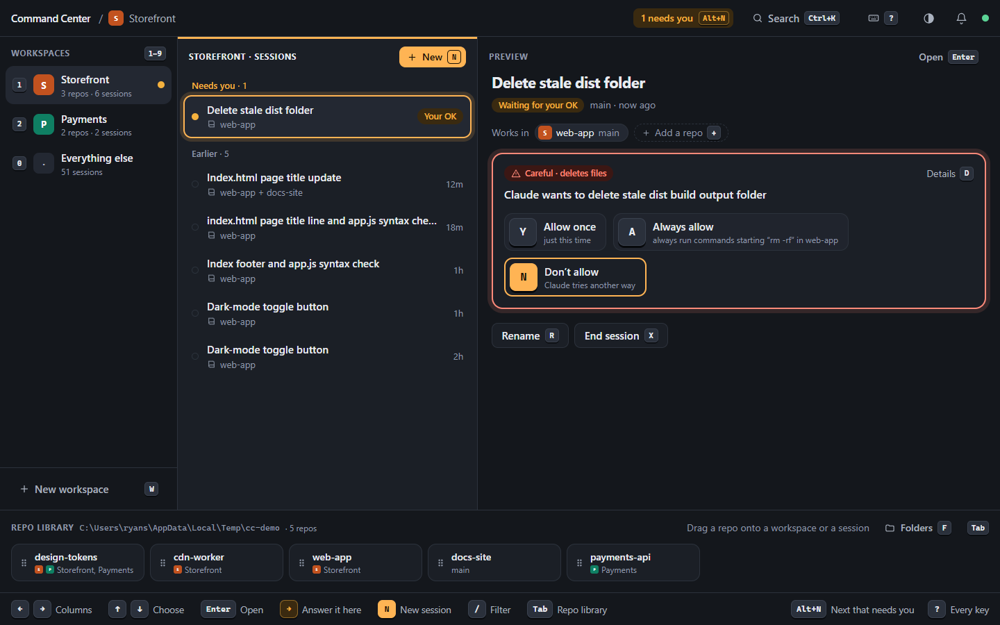
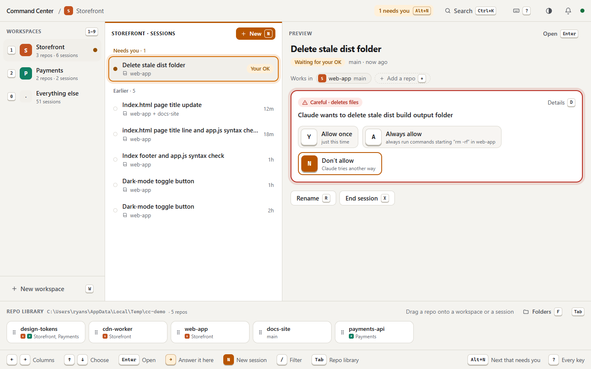

# Command Center for Claude Code

**A keyboard-driven cockpit for your Claude Code sessions.** Group your repos into workspaces, see at a glance what needs you, what's working and what's done, and drive every session with the arrow keys, the number pad or your voice. Everything also works with a mouse.



## Why

Running several Claude Code sessions across several repos means a lot of terminal-tab hunting: which one finished, which one is waiting on a permission prompt, which repo it was in, and typing the same "run the tests and summarise failures" prompt for the tenth time. Command Center puts all of it on one screen and makes the common moves single keystrokes.

- **Workspaces.** Group the repos you work on together ("Storefront", "Payments") and pick them with `1`–`9`. **Every session in a workspace can use all of its repos**, so Claude can change the API and the web app in one go. Your repo folder becomes a **repo library** you drag from: drop a repo on a workspace to add it, or on a single session to give just that one another repo.
- **Know who needs you.** Each workspace's sessions are sorted into *Needs you*, *Working*, *Done* and *Earlier*. `Alt+N` jumps to the next one that needs you from anywhere; `Y` / `A` / `N` answers.
- **Approvals you can judge.** "Claude wants to check app.js for syntax errors", rated *safe*, *makes changes* or *careful* (deletes files, pushes, installs…), with what it touches. The raw command sits behind `D`.
- **Follow along in plain words.** Claude's actions fold into readable steps ("Read index.html", "Changed src/app.js +3") with a real diff behind "See change", and a live line says what it's doing right now. `Esc` stops it, just like in the terminal.
- **Workflows on the number pad.** The pad on screen is drawn like the one under your hand; each key is a saved instruction such as "Run the tests" or "Commit my work". Workspaces come with starter workflows, and share them as a file.
- **Keys you can see.** Every button shows its key, and a bar along the bottom lists the ones that work right now. `?` lists them all (and lets you rebind them); `Ctrl+K` searches everything.

| A session waiting for your OK | Light theme | On a phone |
|---|---|---|
|  |  |  |

## Quick start

You need **Node 24+**, **pnpm**, and the **Claude Code CLI, logged in**. Command Center runs on your existing Claude login; no API key needed.

```sh
git clone https://github.com/ryan-stephens/claude-command-center.git
cd claude-command-center
pnpm install
pnpm start          # builds the app and serves http://localhost:7777
```

Open **http://localhost:7777** in Chrome or Edge. A short tour shows the four groups of keys, then helps you pick your repo folder and make your first workspace. It follows your Windows light or dark setting (`Alt+T` switches).

## Keys you'll use

| Where | Key | Does |
|---|---|---|
| Anywhere | `Alt+N` | Jump to the next session that needs you |
| | `Ctrl+K` | Search actions, workflows, workspaces and sessions |
| | `?` | Every key (`B` there to rebind) |
| | `Alt+↑` / `Alt+↓` | Previous / next session |
| Home | `← →` | Move between columns: workspaces, sessions, preview |
| | `↑ ↓` `Enter` | Choose and open |
| | `1`–`9` / `0` | Pick a workspace / everything outside your workspaces |
| | `N` / `W` | New session here / new workspace |
| | `+` / `−` | Add a repo to this workspace / remove one |
| | `Tab` | The repo library |
| | `C` / `Shift+C` | Fold what you're in (workspace column, a group of sessions, the repo library) / open every group |
| | `F` (in the library) | Pick the folders it lists: walk the disk with `↑ ↓ → ←`, `Space` uses the folder you're in |
| Pickers | `Ctrl+O` | Browse to any folder (new session, add a repo) |
| Session | `Numpad 1–9` / `Alt+1–9` | Run a workflow |
| | `Y` / `A` / `N` | Allow once / always / don't allow (`Tab` first if you're in the message box) |
| | Hold `` ` `` | Push-to-talk |
| | `Esc` (while working) | Stop Claude |
| | `+` / `−` | Give this session another repo / take one back out |
| | `Ctrl+B` | Send the running step to the background |
| | `C` (number pad) | Fold the number pad away; `Tab` still opens it |
| | `/` (start of a message) | Suggests commands and skills as you type, like Claude Code (`/cl` → `/clear`): `↑ ↓` `Tab` `Enter` `Esc` |

## Sharing with your team

**A whole workspace:** on home, select it and press `Shift+E` (or *Export* in its editor). The file lists its repos by folder name and carries its workflows; a teammate imports it with `Shift+I`, and it matches the names against their own repo library.

**Per-repo workflows:** put a pack at `.cc-control/commands.json` in any repo, and everyone who opens a session there gets the same keys:

```json
{
  "version": 1,
  "groups": [
    {
      "name": "Web app",
      "commands": [
        { "slot": 1, "label": "Dev server", "body": "Start the dev server and tell me the URL.", "mode": "send" },
        { "slot": 3, "label": "Add a test for…", "body": "Add a unit test covering {{behaviour}}.", "mode": "template" }
      ]
    }
  ]
}
```

Your own workflows live in a local SQLite file and export or import as the same JSON (`Shift+E` / `Shift+I` on the number pad). To make or change a key, focus it and press `E`.

## How it works

```
Browser (React + Vite)  ⇄  WebSocket  ⇄  Node server on 127.0.0.1:7777
                                           ├─ one Claude Agent SDK session per live conversation
                                           ├─ approvals held until you answer Y / A / N
                                           ├─ history from ~/.claude/projects (resume or fork any session)
                                           ├─ repo library: git repos under the folders you pick
                                           └─ node:sqlite for workspaces, workflows and settings
```

- Built on [`@anthropic-ai/claude-agent-sdk`](https://www.npmjs.com/package/@anthropic-ai/claude-agent-sdk). Sessions are real Claude Code sessions stored alongside your terminal ones: every terminal session is listed here and can be continued, and anything started here can be continued in a terminal with `claude --resume <id>`.
- Extra repos use the SDK's `additionalDirectories`. Adding one to a running session restarts it in place, keeping the conversation.
- If a session looks open in a terminal, sending to it **forks** a copy instead of writing into the same transcript.
- Voice uses the browser's Web Speech API (Chrome and Edge send the audio to Google's speech service).

**Security:** the server only listens on `127.0.0.1` and only accepts pages it served itself (Host and Origin checks). It can run tools on your machine, so treat it like a terminal and don't expose it to a network.

## Development

```sh
pnpm dev        # server with --watch + Vite on http://localhost:5173
pnpm test       # unit tests (node:test)
pnpm typecheck
```

| Path | What |
|---|---|
| `server/` | Node server, run as TypeScript directly (Node 24 type stripping, no build step) |
| `web/` | React SPA; `web/keys.ts` is the single keyboard router, `web/plain.ts` all the plain-language wording |
| `shared/` | WebSocket message types and the workspace logic both sides use |
| `docs/PLAN.md` | Design, decisions and per-phase notes; `docs/UX-AUDIT.md` and `docs/design-*.html` for the redesign |

<details>
<summary>Advanced: using it from your phone over Tailscale</summary>

Optional and off by default. With [Tailscale](https://tailscale.com) on this machine and your phone:

```sh
pnpm start -- --remote                  # also listens on this machine's Tailscale IP only
pnpm start -- --remote --rotate-token   # revoke the previous sign-in link
```

It prints a one-time sign-in link containing a secret token; open it on your phone and treat it like a password. See `docs/PLAN.md` §14 for the details.
</details>
